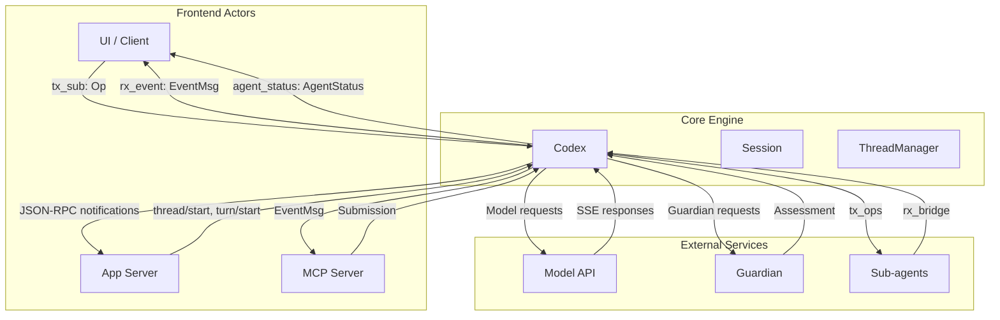

Based on the codebase, here are all the actors and queues in the Codex system:

## Actors

| Actor | Description | Code Reference |
|-------|-------------|----------------|
| **Codex** | Core engine managing session lifecycle and turn execution | `Codex` struct [1](#2-0)  |
| **Session** | Configuration and state for a Codex instance | `Session` struct [2](#2-1)  |
| **ThreadManager** | Factory for creating and managing Codex threads | `ThreadManager::start_thread` [3](#2-2)  |
| **Model** | OpenAI Responses REST API for LLM inference | Referenced in protocol docs [4](#2-3)  |
| **UI/Frontend** | Client driving Codex (CLI/TUI, VSCode extension, Python SDK) | External actor sending `Op` submissions [5](#2-4)  |
| **App Server** | JSON-RPC interface for IDE extensions | `codex app-server` [6](#2-5)  |
| **MCP Server** | Model Context Protocol server for external tools | `run_codex_tool_session` [7](#2-6)  |
| **Guardian** | Sub-agent for security review of tool calls | Referenced in tests [8](#2-7)  |
| **Sub-agents** | Review, research, or other specialized agents | `run_codex_thread_interactive` [9](#2-8)  |

## Queues

| Queue | Type | Direction | Purpose | Code Reference |
|-------|------|----------|---------|----------------|
| **Submission Queue (SQ)** | `async_channel::bounded` | UI → Codex | Carries `Op` operations from frontend to core engine | `tx_sub` / `rx_sub` [10](#2-9)  |
| **Event Queue (EQ)** | `async_channel::unbounded` | Codex → UI | Carries `EventMsg` events from core engine to frontend | `tx_event` / `rx_event` [10](#2-9)  |
| **Agent Status Channel** | `watch::channel` | Codex → UI | Broadcasts agent status updates (PendingInit, Running, etc.) | `agent_status_tx` / `agent_status_rx` [11](#2-10)  |
| **Turn Input Queue** | Internal queue | Session → Turn | Manages turn inputs via `TurnInputQueue` | `TurnInputQueue` [12](#2-11)  |
| **Sub-agent Ops Queue** | `async_channel::bounded` | Parent → Sub-agent | Forwards operations to interactive sub-agents | `tx_ops` / `rx_ops` [13](#2-12)  |
| **Event Bridge Queue** | `async_channel::bounded` | Sub-agent → Parent | Bridges events from one-shot sub-agents back to parent | `tx_bridge` / `rx_bridge` [14](#2-13)  |

## Queue Data Types

**Submission Queue Payload (`Submission`):**
```rust
pub struct Submission {
    pub id: String,
    pub op: Op,
    pub client_user_message_id: Option<String>,
    pub trace: Option<W3cTraceContext>,
}
``` [15](#2-14) 

**Event Queue Payload (`Event`):**
```rust
pub struct Event {
    pub id: String,
    pub msg: EventMsg,
}
``` [16](#2-15) 

## Actor-Queue Relationships



## Notes

- The **Submission Queue** is bounded with `SUBMISSION_CHANNEL_CAPACITY` to prevent memory pressure [10](#2-9) 
- The **Event Queue** is unbounded to ensure events are never dropped [10](#2-9) 
- **Agent Status** uses a `watch::channel` which allows multiple receivers to get the current value and future updates [11](#2-10) 
- Sub-agent communication uses additional queues to isolate parent and child agent execution contexts [13](#2-12) 

Wiki pages you might want to explore:
- [Glossary (openai/codex)](/wiki/openai/codex#10)

### Citations

**File:** codex-rs/core/src/session/mod.rs (L230-232)
```rust
pub(crate) use self::input_queue::InputQueueActivity;
pub(crate) use self::input_queue::TurnInput;
pub(crate) use self::input_queue::TurnInputQueue;
```

**File:** codex-rs/core/src/session/mod.rs (L392-401)
```rust
pub struct Codex {
    pub(crate) tx_sub: Sender<Submission>,
    pub(crate) rx_event: Receiver<Event>,
    // Last known status of the agent.
    pub(crate) agent_status: watch::Receiver<AgentStatus>,
    pub(crate) session: Arc<Session>,
    // Shared future for the background submission loop completion so multiple
    // callers can wait for shutdown.
    pub(crate) session_loop_termination: SessionLoopTermination,
}
```

**File:** codex-rs/core/src/session/mod.rs (L533-534)
```rust
        let (tx_sub, rx_sub) = async_channel::bounded(SUBMISSION_CHANNEL_CAPACITY);
        let (tx_event, rx_event) = async_channel::unbounded();
```

**File:** codex-rs/core/src/session/mod.rs (L653-653)
```rust
        let (agent_status_tx, agent_status_rx) = watch::channel(AgentStatus::PendingInit);
```

**File:** codex-rs/core/src/session/mod.rs (L655-682)
```rust
        let session = Box::pin(Session::new(
            session_configuration,
            config.clone(),
            user_instructions,
            installation_id,
            auth_manager.clone(),
            models_manager.clone(),
            exec_policy,
            tx_event.clone(),
            agent_status_tx.clone(),
            conversation_history,
            session_source_clone,
            skills_service,
            plugins_manager,
            mcp_manager.clone(),
            extensions,
            thread_extension_init,
            supports_openai_form_elicitation,
            agent_control,
            environment_manager,
            inherited_environments,
            analytics_events_client,
            thread_store,
            parent_rollout_thread_trace,
            attestation_provider,
            external_time_provider,
            multi_agent_version,
        ))
```

**File:** codex-rs/docs/protocol_v1.md (L11-13)
```markdown
0. `Model`
   - In our case, this is the Responses REST API
1. `Codex`
```

**File:** codex-rs/docs/protocol_v1.md (L43-43)
```markdown
The term "UI" is used to refer to the application driving `Codex`. This may be the CLI / TUI chat-like interface that users operate, or it may be a GUI interface like a VSCode extension. The UI is external to `Codex`, as `Codex` is intended to be operated by arbitrary UI implementations.
```

**File:** codex-rs/app-server/README.md (L74-82)
```markdown
## Lifecycle Overview

- Initialize once per connection: Immediately after opening a transport connection, send an `initialize` request with your client metadata, then emit an `initialized` notification. Any other request on that connection before this handshake gets rejected.
- Start (or resume) a thread: Call `thread/start` to open a fresh conversation. The response returns the thread object and you’ll also get a `thread/started` notification. If you’re continuing an existing conversation, call `thread/resume` with its ID instead. If you want to branch from an existing conversation, call `thread/fork` to create a new thread id with copied history. Like `thread/start`, `thread/fork` also accepts `ephemeral: true` for an in-memory temporary thread.
  The returned `thread.ephemeral` flag tells you whether the session is intentionally in-memory only; when it is `true`, `thread.path` is `null`.
- Begin a turn: To send user input, call `turn/start` with the target `threadId` and the user's input. Optional fields let you override model, cwd, sandbox policy or experimental `permissions` profile selection, approval policy, approvals reviewer, etc. This immediately returns the new turn object. The app-server emits `turn/started` when that turn actually begins running.
- Stream events: After `turn/start`, keep reading JSON-RPC notifications on stdout. You’ll see `item/started`, `item/completed`, deltas like `item/agentMessage/delta`, tool progress, etc. These represent streaming model output plus any side effects (commands, tool calls, reasoning notes).
- Finish the turn: When the model is done (or the turn is interrupted via making the `turn/interrupt` call), the server sends `turn/completed` with the final turn state and token usage.

```

**File:** codex-rs/mcp-server/src/codex_tool_runner.rs (L57-78)
```rust
pub async fn run_codex_tool_session(
    id: RequestId,
    initial_prompt: String,
    config: CodexConfig,
    outgoing: Arc<OutgoingMessageSender>,
    thread_manager: Arc<ThreadManager>,
    running_requests_id_to_codex_uuid: Arc<Mutex<HashMap<RequestId, ThreadId>>>,
) {
    let NewThread {
        thread_id,
        thread,
        session_configured,
    } = match thread_manager.start_thread(config.clone()).await {
        Ok(res) => res,
        Err(e) => {
            let result = CallToolResult::error(vec![Content::text(format!(
                "Failed to start Codex session: {e}"
            ))]);
            outgoing.send_response(id.clone(), result).await;
            return;
        }
    };
```

**File:** codex-rs/core/src/session/tests.rs (L6858-6861)
```rust
    parent_session
        .guardian_review_session
        .cache_for_test(child_codex)
        .await;
```

**File:** codex-rs/core/src/codex_delegate.rs (L69-128)
```rust
pub(crate) async fn run_codex_thread_interactive(
    config: Config,
    auth_manager: Arc<AuthManager>,
    models_manager: SharedModelsManager,
    parent_session: Arc<Session>,
    parent_ctx: Arc<TurnContext>,
    cancel_token: CancellationToken,
    subagent_source: SubAgentSource,
    initial_history: Option<InitialHistory>,
) -> Result<Codex, CodexErr> {
    let (tx_sub, rx_sub) = async_channel::bounded(SUBMISSION_CHANNEL_CAPACITY);
    let (tx_ops, rx_ops) = async_channel::bounded(SUBMISSION_CHANNEL_CAPACITY);
    let conversation_history = initial_history.unwrap_or(InitialHistory::New);
    let forked_from_thread_id = conversation_history.forked_from_id();
    let user_instructions = LoadedUserInstructions {
        instructions: parent_session.user_instructions().await,
        warnings: Vec::new(),
    };
    let CodexSpawnOk { codex, .. } = Box::pin(Codex::spawn(CodexSpawnArgs {
        config,
        user_instructions,
        installation_id: parent_session.installation_id.clone(),
        auth_manager,
        models_manager,
        environment_manager: parent_session
            .services
            .turn_environments
            .environment_manager(),
        skills_service: Arc::clone(&parent_session.services.skills_service),
        plugins_manager: Arc::clone(&parent_session.services.plugins_manager),
        mcp_manager: Arc::clone(&parent_session.services.mcp_manager),
        extensions: Arc::clone(&parent_session.services.extensions),
        conversation_history,
        session_source: SessionSource::SubAgent(subagent_source.clone()),
        forked_from_thread_id,
        parent_thread_id: Some(parent_session.thread_id),
        thread_source: Some(ThreadSource::Subagent),
        agent_control: parent_session.services.agent_control.clone(),
        dynamic_tools: Vec::new(),
        metrics_service_name: None,
        user_shell_override: None,
        inherited_environments: Some(parent_ctx.environments.clone()),
        inherited_exec_policy: Some(Arc::clone(&parent_session.services.exec_policy)),
        parent_rollout_thread_trace: codex_rollout_trace::ThreadTraceContext::disabled(),
        parent_trace: None,
        environment_selections: parent_ctx.environments.to_selections(),
        thread_extension_init: codex_extension_api::ExtensionDataInit::default(),
        supports_openai_form_elicitation: parent_session
            .services
            .supports_openai_form_elicitation
            .load(std::sync::atomic::Ordering::Relaxed),
        analytics_events_client: Some(parent_session.services.analytics_events_client.clone()),
        thread_store: Arc::clone(&parent_session.services.thread_store),
        attestation_provider: parent_session.services.attestation_provider.clone(),
        external_time_provider: Some(Arc::clone(&parent_session.services.time_provider)),
        inherited_multi_agent_version: Some(MultiAgentVersion::Disabled),
    }))
    .or_cancel(&cancel_token)
    .await??;
    let thread_config = codex.thread_config_snapshot().await;
```

**File:** codex-rs/core/src/codex_delegate.rs (L223-223)
```rust
    let (tx_bridge, rx_bridge) = async_channel::bounded(SUBMISSION_CHANNEL_CAPACITY);
```

**File:** codex-rs/protocol/src/protocol.rs (L152-162)
```rust
#[derive(Debug, Clone)]
pub struct Submission {
    /// Unique id for this Submission to correlate with Events
    pub id: String,
    /// Payload
    pub op: Op,
    /// Client-provided id for the user message represented by `Op::UserInput`.
    pub client_user_message_id: Option<String>,
    /// Optional W3C trace carrier propagated across async submission handoffs.
    pub trace: Option<W3cTraceContext>,
}
```

**File:** codex-rs/protocol/src/protocol.rs (L1207-1214)
```rust
/// Event Queue Entry - events from agent
#[derive(Debug, Clone, Deserialize, Serialize)]
pub struct Event {
    /// Submission `id` that this event is correlated with.
    pub id: String,
    /// Payload
    pub msg: EventMsg,
}
```
