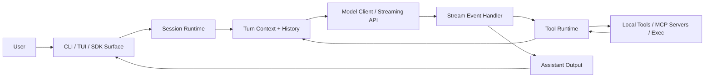
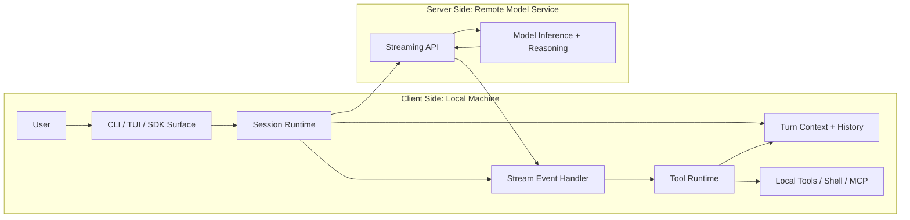
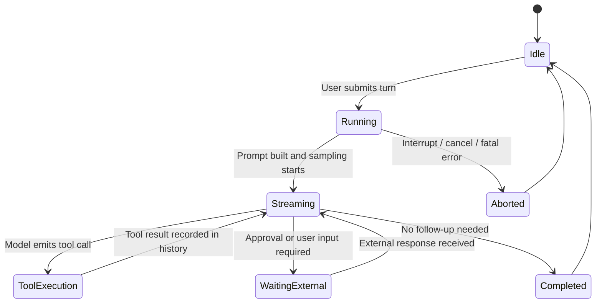
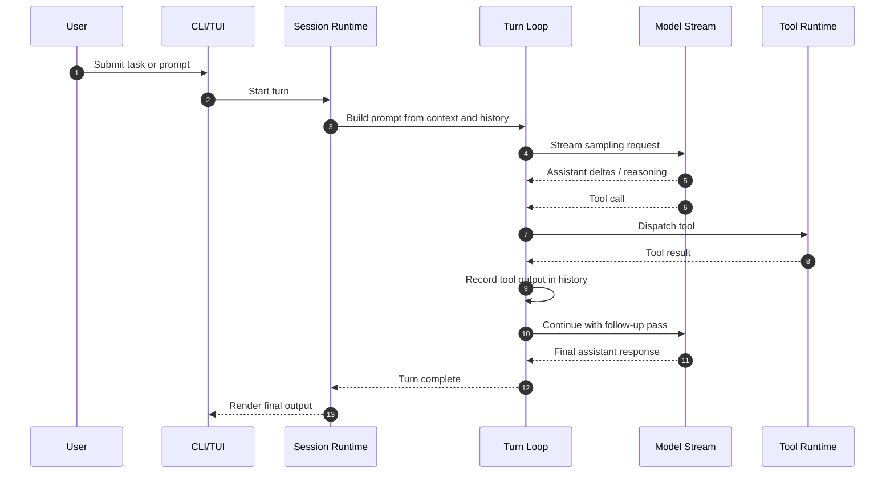
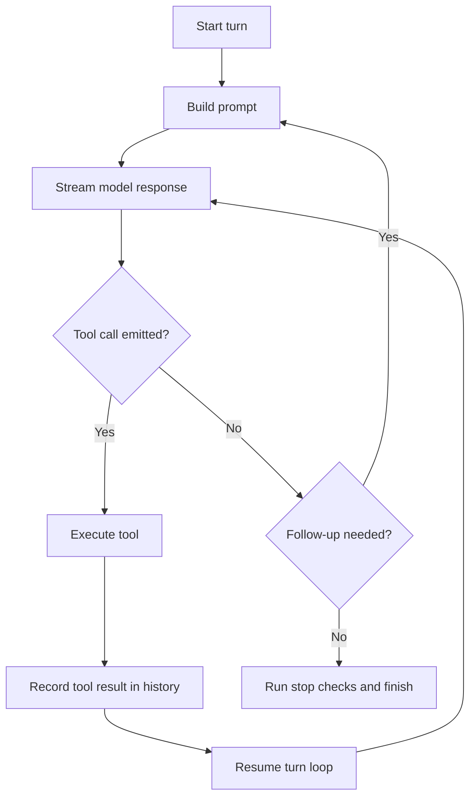

# Generic Codex Architecture Notes

This repository contains a local copy of the `codex/` source tree. This README summarizes a generic Codex-style architecture based on the runtime and state-machine docs in that tree, with an emphasis on the core happy path.

## Core System Shape

At a high level, Codex behaves like an event-driven agent runtime:

- A user submits a prompt through a CLI or UI surface.
- The session runtime builds turn context and prompt state.
- A model stream produces assistant output, tool calls, and completion signals.
- Tool results are reinjected into turn history when follow-up work is needed.
- The turn exits when no more follow-up is required or when an external wait interrupts progress.

## Top-Level Component Diagram

## Client Side vs Server Side

In this architecture, most of the orchestration is client side and runs locally on the user's machine.

### Client Side

- `CLI / TUI / SDK surface`
- `Session runtime`
- `Turn context + local history`
- `Stream event handling`
- `Tool runtime`
- `Local shell execution, filesystem access, sandboxing, and MCP client behavior`

These parts are responsible for prompt assembly, local policy enforcement, tool dispatch, approval handling, and rendering streamed output back to the user.

### Server Side

- `Model inference service`
- `Streaming API endpoint`
- `Hosted reasoning / completion generation`

These parts are responsible for turning the prompt into streamed assistant output, tool call requests, and final completion signals.

### Boundary Diagram

## Runtime Control Plane

This view maps the major runtime states described in the Codex learning notes.

## Happy Path Flow

The core happy path is a loop rather than a single request/response:

1. The user starts a turn.
2. The session runtime assembles prompt state from config, environment, and conversation history.
3. The model begins streaming events.
4. If the model emits plain assistant output, that output is surfaced immediately.
5. If the model emits a tool call, the tool runtime executes it and records the result back into history.
6. The runtime performs another sampling pass with the new tool output in context.
7. When the model no longer requests follow-up work, the turn completes.

## Happy Path Sequence Diagram

## Generic Tool-Driven Follow-Up Loop

This is the most important architectural behavior in Codex: tool calls keep the same turn alive.

## Main Boundaries

- `UI surface`: interactive CLI/TUI or non-interactive execution entry point.
- `Session runtime`: owns task orchestration, turn setup, and event fan-out.
- `Turn loop`: runs prompt construction, streaming, follow-up checks, and completion logic.
- `Tool runtime`: dispatches local tools, shell execution, and MCP-backed integrations.
- `External wait`: approvals or explicit user input can pause a turn without ending it.
- `Remote model service`: generates streamed assistant output and tool call intents, but does not run the local shell or mutate the local workspace directly.

## Practical Reading Map

If you want the actual implementation details inside `codex/`, these are the most useful starting points:

- `codex/README.md`
- `codex/codex-rs/README.md`
- `codex/codex-rs/core/README.md`
- `codex/learning/statemachine/README.md`
- `codex/learning/turn-execution/01-turn-tool-execution-state-machine.md`
